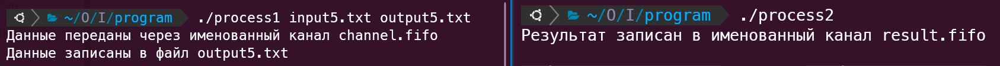
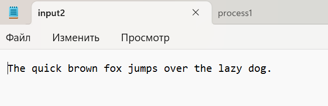

# Индивидуальное домашнее задание № 1
## __Кухтина Юлия Егоровна, БПИ224__
## Вариант № 19
### Условие: Разработать программу, заменяющую все согласные буквы в заданной ASCII–строке на заглавные.


## Отчет
### Программа выполнена с учетом требований на 9 баллов
### Организация программы
#### Программа вместе с тестовыми файлами находится в папке program, сама программа разделена на 2 процесса (файла) - process1.c и process2.c . 
#### Тестовые входящие данные представлены в файлах input1.txt ..., Результрующие данные в файлах output1.txt ... 
### Общая схема решаемой задачи:
#### Процесс 1 (process1):

* Читает текстовые данные из входного файла.
* Создает и открывает именованный канал (input.fifo) для записи.
* Передает текстовые данные через именованный канал в Процесс 2.
* Открывает выходной файл для записи.
* Читает результаты обработки из именованного канала (result.fifo) Процесса 2.
* Записывает результаты в выходной файл.
* Закрывает именованные каналы и файлы.

#### Процесс 2 (process2):

* Открывает именованный канал (input.fifo), созданный Процессом 1, для чтения.
* Создает и открывает именованный канал (result.fifo) для записи результатов.
* Читает текстовые данные из именованного канала.
* Обрабатывает данные, преобразуя согласные буквы в верхний регистр.
* Записывает обработанные данные обратно в именованный канал.
* Закрывает именованные каналы.

#### Процесс 1 и Процесс 2 обмениваются данными через именованные каналы, при этом Процесс 1 передает текстовые данные Процессу 2, а Процесс 2 возвращает обработанные данные Процессу 1. Каждый процесс также выполняет операции ввода-вывода с файлами: Процесс 1 читает данные из входного файла и записывает результаты в выходной файл, в то время как Процесс 2 не работает с файлами напрямую.

### Особенности программы
#### В соответствии с требованиями для задания имен входного и выходного файлов используются аргументы командной строки, при этом ввод некорректных параметров обрабатывается. 
#### Ввод и вывод данных при работе с файлами осуществляется через read и write. 
#### Размер буферов для хранения вводимых данных и результатов обработки не превышают 128 байт
#### Работа программы осуществляется с файлами произвольного размера

### Запуск программы
```
gcc process1.c -o process1
gcc process2.c -o process2
./process1 <input_file> <output_file> # указываем файлы для чтения и записи
./process2 # в отдельном терминале
```
Например:
```
gcc process1.c -o process1
gcc process2.c -o process2
./process1 input1.txt output1.txt # указываем файлы для чтения и записи
./process2 # в отдельном терминале
```

### Результаты работы


